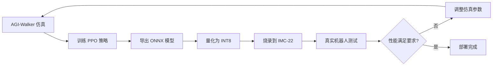

# 硬件集成指南：从 AGI-Walker 仿真到 IMC-22 部署

## 📋 概述

本指南介绍如何将在 AGI-Walker 中训练的控制策略部署到基于 IMC-22 芯片的真实硬件。

---

## 🔄 Sim-to-Real 工作流

```
1. 仿真训练 (AGI-Walker) → 2. 策略导出 (ONNX) → 3. 模型量化 (INT8) → 4. 硬件部署 (IMC-22)
```

### 完整流程图



---

## 📦 第一步：环境准备

### 1.1 Python 依赖

```bash
# 基础仿真环境（已有）
pip install gymnasium numpy stable-baselines3

# 硬件部署工具（新增）
pip install python-can onnx torch
```

### 1.2 工具链安装

```bash
# RISC-V 工具链
# Ubuntu/Debian:
sudo apt-get install gcc-riscv32-unknown-elf

# macOS:
brew install riscv-gnu-toolchain

# Windows:
# 下载预编译版本: https://github.com/riscv/riscv-gnu-toolchain/releases
```

### 1.3 硬件准备

| 组件 | 数量 | 说明 |
|------|------|------|
| IMC-22 开发板 | N 个 | N = 关节数量 |
| CAN 适配器 | 1 个 | USB-CAN 或 SPI-CAN |
| 电源 | 1 个 | 5V 供电 |
| J-Link 调试器 | 1 个 | （可选）用于调试 |

---

## 🎓 第二步：在仿真中训练策略

### 2.1 使用 AGI-Walker 训练

```python
from godot_robot_env import GodotRobotEnv
from stable_baselines3 import PPO

# 创建环境
env = GodotRobotEnv(
    env_preset="earth",      # 使用地球重力
    ground_material="concrete"  # 混凝土地面
)

# 训练策略
model = PPO("MultiInputPolicy", env, verbose=1)
model.learn(total_timesteps=500000)

# 保存模型
model.save("walker_policy")
```

### 2.2 评估性能

```python
# 测试训练好的策略
obs, info = env.reset()
for _ in range(1000):
    action, _states = model.predict(obs, deterministic=True)
    obs, reward, terminated, truncated, info = env.step(action)
    if terminated or truncated:
        obs, info = env.reset()
```

---

## 📤 第三步：导出模型

### 3.1 提取神经网络

```python
import torch

# 提取策略网络
policy_net = model.policy.mlp_extractor

# 导出为 ONNX
dummy_input = torch.randn(1, env.observation_space.shape[0])
torch.onnx.export(
    policy_net,
    dummy_input,
    "walker_policy.onnx",
    input_names=['observation'],
    output_names=['action'],
    opset_version=11
)

print(f"模型已导出: walker_policy.onnx")
```

### 3.2 模型量化

```python
import onnx
from onnxruntime.quantization import quantize_dynamic, QuantType

# 动态量化为 INT8
quantize_dynamic(
    "walker_policy.onnx",
    "walker_policy_int8.onnx",
    weight_type=QuantType.QInt8
)

# 检查模型大小
import os
fp32_size = os.path.getsize("walker_policy.onnx") / 1024
int8_size = os.path.getsize("walker_policy_int8.onnx") / 1024
print(f"FP32: {fp32_size:.2f} KB")
print(f"INT8: {int8_size:.2f} KB (压缩 {(1-int8_size/fp32_size)*100:.1f}%)")
```

---

## 🔧 第四步：烧录固件

### 4.1 编译 IMC-22 固件

```bash
cd hive-reflex

# 复制模型权重（需要转换为 C 数组）
python tools/onnx_to_c_array.py walker_policy_int8.onnx > reflex_weights.c

# 编译固件
make APP_SRCS=examples/example_reflex_node.c
```

### 4.2 烧录到硬件

```bash
# 使用 OpenOCD 烧录
make flash

# 或手动烧录
openocd -f interface/jlink.cfg -f target/riscv.cfg \
        -c "program build/hive_node.bin verify reset exit"
```

---

## 🔌 第五步：配置 CAN 网络

### 5.1 网络拓扑

```
主控 PC (Python)  ←→  CAN 适配器  ←→  IMC-22 节点 1 (ID=1)
                                   ←→  IMC-22 节点 2 (ID=2)
                                   ←→  ...
                                   ←→  IMC-22 节点 N (ID=N)
```

### 5.2 Python CAN 接口

```python
import can

# 初始化 CAN 总线
bus = can.interface.Bus(
    channel='can0',          # Linux: can0, Windows: PCAN_USBBUS1
    bustype='socketcan',     # Linux: socketcan, Windows: pcan
    bitrate=1000000          # 1 Mbps
)

# 发送命令到节点 1
def send_command(node_id, target_angle, compliance):
    # 将角度转换为 int16 (单位: 0.01度)
    angle_int16 = int(target_angle * 100)
    
    msg = can.Message(
        arbitration_id=0x200 + node_id,
        data=[
            angle_int16 & 0xFF,
            (angle_int16 >> 8) & 0xFF,
            int(compliance * 255)
        ],
        is_extended_id=False
    )
    bus.send(msg)

# 示例：设置节点 1 目标角度为 45度，柔顺度 0.5
send_command(node_id=1, target_angle=45.0, compliance=0.5)
```

### 5.3 接收状态反馈

```python
# 读取节点状态
msg = bus.recv(timeout=0.1)
if msg and msg.arbitration_id >= 0x100 and msg.arbitration_id < 0x200:
    node_id = msg.arbitration_id - 0x100
    angle = int.from_bytes(msg.data[0:2], 'little', signed=True) * 0.01
    current = int.from_bytes(msg.data[2:4], 'little') * 0.001  # mA
    print(f"节点 {node_id}: 角度={angle:.2f}°, 电流={current:.2f}A")
```

---

## 🧪 第六步：实时控制

### 6.1 控制循环

```python
import time

def hardware_control_loop():
    """100 Hz 控制循环"""
    
    while True:
        start_time = time.time()
        
        # 1. 读取所有节点状态
        states = {}
        for node_id in range(1, 13):  # 假设 12 个关节
            msg = bus.recv(timeout=0.001)
            if msg:
                states[node_id] = parse_status(msg)
        
        # 2. 使用策略网络计算动作
        # （在 PC 端运行推理，或直接在 IMC-22 上运行）
        observation = build_observation(states)
        action = model.predict(observation)[0]
        
        # 3. 发送命令到各节点
        for node_id, target in enumerate(action, start=1):
            send_command(node_id, target, compliance=0.5)
        
        # 4. 保持 100 Hz
        elapsed = time.time() - start_time
        if elapsed < 0.01:
            time.sleep(0.01 - elapsed)

# 运行控制循环
hardware_control_loop()
```

---

## ⚠️ 常见问题和调试

### Q1: 仿真策略在真实硬件上表现不佳？

**原因**: Sim-to-Real Gap（仿真与现实差距）

**解决方案**:
1. **域随机化训练**
   ```python
   from godot_robot_env import DomainRandomizationWrapper
   env = DomainRandomizationWrapper(GodotRobotEnv())
   ```

2. **调整物理参数**
   - 增加仿真中的摩擦力
   - 添加传感器噪声
   - 模拟电机延迟

3. **在硬件上微调**
   - 收集真实数据
   - 使用迁移学习

### Q2: CAN 通信不稳定？

**检查清单**:
- [ ] CAN 总线终端电阻（120Ω）
- [ ] 波特率是否匹配（1 Mbps）
- [ ] 线缆长度（建议 < 5m）
- [ ] 电源地是否共地

### Q3: IMC-22 推理速度慢？

**优化方案**:
- 使用 INT8 量化（已完成）
- 简化模型（减少隐藏层）
- 提高控制频率到 NPU 内部运行

---

## 📊 性能对比

| 指标 | 仿真 (AGI-Walker) | 真实硬件 (IMC-22) |
|------|------------------|------------------|
| 控制频率 | 60 Hz (Godot) | 1000 Hz |
| 延迟 | 16 ms | < 0.1 ms |
| 传感器噪声 | 可配置 | 真实噪声 |
| 功耗 | - | ~6 W (12 节点) |

---

## 🎯 最佳实践

1. **渐进式部署**
   - 先在单个关节上测试
   - 逐步增加节点数量
   - 最后测试完整机器人

2. **安全措施**
   - 设置力矩限制
   - 实现紧急停止
   - 软启动和软停止

3. **数据记录**
   - 记录所有传感器数据
   - 用于分析和改进

4. **版本控制**
   - 保存每个版本的固件
   - 记录部署配置

---

## 📚 参考资源

- [IMC-22 硬件规格](HARDWARE_SPEC.md)
- [Hive-Reflex SDK 指南](../hive-reflex/SDK_GUIDE.md)
- [AGI-Walker 零件库](PARTS_LIBRARY_GUIDE.md)

---

**文档版本**: 1.0  
**最后更新**: 2026-01-16  
**维护者**: AGI-Walker Team
