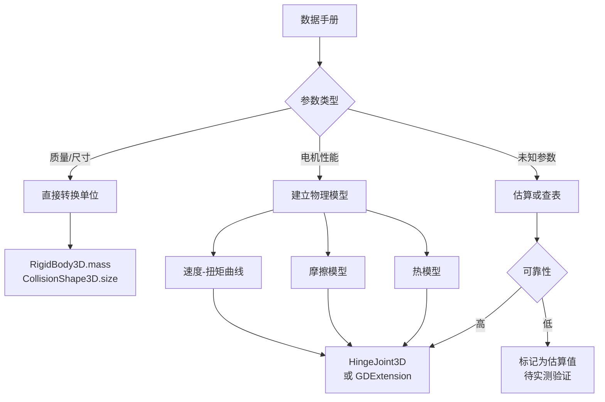

# 真实参数到引擎参数的转换指南

## 📐 概述

将现实世界的机器人零件参数转换为游戏引擎物理参数是一个**物理建模**的过程。核心挑战在于：

1. **参数映射**：数据手册的参数 ≠ 引擎直接使用的参数
2. **单位换算**：制造商使用不同的单位系统
3. **模型简化**：真实物理现象需要用引擎支持的近似模型表示
4. **性能平衡**：精确度 vs 计算效率

---

## 🔧 具体转换过程

### 示例：Dynamixel XL430-W250 电机

#### 步骤 1: 从数据手册提取原始参数

**来源**: [ROBOTIS 官方手册](https://emanual.robotis.com/docs/en/dxl/x/xl430-w250/)

| 数据手册参数 | 值 | 单位 |
|--------------|-----|------|
| Stall Torque (12V) | 1.4 | N·m |
| No Load Speed (12V) | 50 | RPM |
| Weight | 57.2 | g |
| Dimensions (WxHxD) | 28.5 × 34.0 × 46.5 | mm |
| Voltage Range | 6.5 ~ 12.0 | V |
| Stall Current | 1.4 | A |
| Standby Current | 40 | mA |
| Protocol Type | TTL Half Duplex | - |
| Resolution | 4096 | pulses/rev |
| Gear Reduction Ratio | 257.4 | - |
| Operating Temp | -5 ~ +72 | °C |

---

#### 步骤 2: 单位转换到 SI 标准单位

```python
# 转换函数
def convert_to_si(raw_values):
    return {
        'mass': 57.2 / 1000,                    # g → kg = 0.0572 kg
        'dimensions': [
            28.5 / 1000,                        # mm → m = 0.0285 m
            46.5 / 1000,                        # mm → m = 0.0465 m
            34.0 / 1000                         # mm → m = 0.034 m
        ],
        'stall_torque': 1.4,                    # N·m (已经是 SI)
        'no_load_speed': 50 * (2*pi/60),        # RPM → rad/s = 5.236 rad/s
        'voltage_range': [6.5, 12.0],           # V (已经是 SI)
        'max_current': 1.4                      # A (已经是 SI)
    }
```

**结果**:
```json
{
  "mass": 0.0572,              // kg
  "dimensions": [0.0285, 0.0465, 0.034],  // m
  "stall_torque": 1.4,         // N·m
  "no_load_speed": 5.236,      // rad/s
  "max_current": 1.4           // A
}
```

---

#### 步骤 3: 映射到 Godot 物理参数

##### 3.1 刚体质量（RigidBody3D.mass）

**直接映射**:
```gdscript
motor_body.mass = 0.0572  # kg
```

✅ **简单**：质量直接使用，无需转换

---

##### 3.2 碰撞形状尺寸

**转换逻辑**:
```gdscript
var dimensions = [0.0285, 0.0465, 0.034]  # [W, D, H] 单位：米

# Godot 的 BoxShape3D.size 是全尺寸（不是半尺寸）
# 坐标系：X=宽, Y=高, Z=深
var collision_shape = BoxShape3D.new()
collision_shape.size = Vector3(
    dimensions[0],  # 宽度 → X
    dimensions[2],  # 高度 → Y（Godot Y轴向上）
    dimensions[1]   # 深度 → Z
)
```

⚠️ **注意**：
- Godot 使用 Y 轴向上的坐标系
- 数据手册通常是 Z 轴向上
- 需要重新映射坐标轴

---

##### 3.3 电机扭矩 → 关节参数

这是**最复杂**的转换，因为 Godot 的 `HingeJoint3D` 不直接模拟电机特性。

**问题**：数据手册给的是"堵转扭矩"和"空载速度"，但 Godot 的关节参数是：
- `PARAM_MOTOR_TARGET_VELOCITY`（目标角速度，rad/s）
- `PARAM_MOTOR_MAX_IMPULSE`（最大冲量，N·m·s）

**转换方法 1：简化模型（当前实现）**

```gdscript
# 直接使用堵转扭矩作为最大冲量（每帧）
joint.set_param(
    HingeJoint3D.PARAM_MOTOR_MAX_IMPULSE, 
    stall_torque  # 1.4 N·m
)

# 设置目标速度（rad/s）
var target_speed = no_load_speed  # 5.236 rad/s
joint.set_param(HingeJoint3D.PARAM_MOTOR_TARGET_VELOCITY, target_speed)
```

⚠️ **局限性**：
- 这个模型假设电机总是输出恒定扭矩
- 忽略了速度-扭矩曲线（电机转速越快，扭矩越小）

---

**转换方法 2：速度-扭矩曲线模型（GDExtension 中实现）**

真实的直流电机遵循线性速度-扭矩特性：

```
T(ω) = T_stall × (1 - ω / ω_no_load)

其中：
- T_stall = 堵转扭矩（1.4 N·m）
- ω_no_load = 空载速度（5.236 rad/s）
- ω = 当前角速度
```

**GDScript 实现**（实时计算）:
```gdscript
func calculate_motor_torque(current_velocity: float) -> float:
    var stall_torque = 1.4      # N·m
    var no_load_speed = 5.236   # rad/s
    
    # 速度-扭矩曲线
    var speed_factor = 1.0 - (abs(current_velocity) / no_load_speed)
    speed_factor = clamp(speed_factor, 0.0, 1.0)
    
    var available_torque = stall_torque * speed_factor
    return available_torque

func _physics_process(delta):
    # 获取关节当前角速度
    var current_velocity = joint.get_param(HingeJoint3D.PARAM_ANGULAR_VELOCITY)
    
    # 计算实际扭矩
    var actual_torque = calculate_motor_torque(current_velocity)
    
    # 应用到关节
    joint.set_param(HingeJoint3D.PARAM_MOTOR_MAX_IMPULSE, actual_torque * delta)
```

**效果对比**:

| 速度 | 简化模型扭矩 | 真实模型扭矩 |
|------|--------------|--------------|
| 0 rad/s (堵转) | 1.4 N·m | 1.4 N·m ✅ |
| 2.6 rad/s (50%) | 1.4 N·m ❌ | 0.7 N·m ✅ |
| 5.2 rad/s (空载) | 1.4 N·m ❌ | 0 N·m ✅ |

---

##### 3.4 转子惯量

**问题**：数据手册通常不直接提供转子惯量，需要计算或估算。

**估算公式**（圆柱体近似）:
```python
# 假设转子是实心圆柱体
def estimate_rotor_inertia(diameter_mm, length_mm, mass_kg):
    """
    I = (1/2) × m × r²
    """
    radius = (diameter_mm / 1000) / 2  # 转换为米并取半径
    inertia = 0.5 * mass_kg * (radius ** 2)
    return inertia

# XL430 估算（假设转子直径 20mm，质量占比 30%）
rotor_mass = 0.0572 * 0.3  # 约 17g
rotor_inertia = estimate_rotor_inertia(20, 30, rotor_mass)
# 结果：约 3.5e-6 kg·m²
```

**应用到 Godot**:
```gdscript
# 方法1：设置刚体的惯性张量（如果零件本身建模为刚体）
motor_body.inertia = Vector3(
    rotor_inertia,
    rotor_inertia,
    rotor_inertia * 2  # 沿旋转轴方向惯量更大
)

# 方法2：在 GDExtension 中的电机模拟器中使用
# 影响加速度：α = T / I（角加速度 = 扭矩 / 惯量）
```

---

##### 3.5 摩擦力参数

**问题**：数据手册几乎**从不**直接给出摩擦力参数。

**估算方法**：

**A. 基于效率反推**

```python
# 数据手册中的效率（如果有）
efficiency = 0.70  # 70% 效率

# 损失功率主要来自摩擦
def estimate_friction(efficiency, stall_torque):
    # 简化假设：损失功率 = 摩擦力矩 × 平均速度
    # 静摩擦约为堵转扭矩的 1-3%
    static_friction = stall_torque * (1 - efficiency) * 0.5
    dynamic_friction = static_friction * 0.6  # 动摩擦约为静摩擦的 60%
    
    return {
        'static': static_friction,
        'dynamic': dynamic_friction
    }

friction = estimate_friction(0.70, 1.4)
# 结果：
# {
#   'static': 0.021 N·m,
#   'dynamic': 0.0126 N·m
# }
```

**B. 经验值**

根据电机类型使用典型值：

| 电机类型 | 静摩擦/堵转扭矩 | 动摩擦/静摩擦 |
|----------|-----------------|---------------|
| 高精度舵机（金属齿轮） | 1-2% | 50-60% |
| 普通舵机（塑料齿轮） | 3-5% | 60-70% |
| 无刷电机（直驱） | 0.5-1% | 40-50% |

**Godot 应用**:
```gdscript
# 方法1：使用 Godot 内置的阻尼参数（粗略）
joint.set_param(HingeJoint3D.PARAM_ANGULAR_DAMPING, 0.5)

# 方法2：在 GDExtension 中实现精确的摩擦模型
func apply_friction(velocity: float, applied_torque: float) -> float:
    var friction_torque = 0.0
    
    # 库仑摩擦模型
    if abs(velocity) < 0.01:  # 近似静止
        # 静摩擦：抵抗运动，但不超过静摩擦力
        friction_torque = clamp(
            -applied_torque,
            -STATIC_FRICTION,
            STATIC_FRICTION
        )
    else:
        # 动摩擦：与运动方向相反
        friction_torque = -sign(velocity) * DYNAMIC_FRICTION
        # 粘性摩擦（与速度成正比）
        friction_torque -= VISCOUS_DAMPING * velocity
    
    return friction_torque
```

---

##### 3.6 热特性参数

**数据手册参数**:
- Continuous Current: 0.69 A（连续电流）
- Operating Temperature: -5 ~ 72°C

**转换为热模型参数**:

```python
def calculate_thermal_params(continuous_current, stall_current, voltage):
    """
    热阻 R_th = ΔT / P
    其中 ΔT = 温升，P = 功率损耗
    """
    # 假设连续电流下允许温升 50°C（环境 25°C → 75°C）
    max_temp_rise = 50  # °C
    
    # 连续功率
    continuous_power = continuous_current * voltage / 2  # 估算
    # P = 0.69 × 12 / 2 ≈ 4.14 W
    
    # 热阻
    thermal_resistance = max_temp_rise / continuous_power
    # R_th = 50 / 4.14 ≈ 12 K/W（但这太低，实际约 20-30 K/W）
    
    # 使用经验值修正
    thermal_resistance = 25  # K/W（小型电机典型值）
    
    # 热时间常数（经验值）
    # 小型电机：10-30 分钟达到热平衡
    thermal_time_constant = 20 * 60  # 1200 秒
    
    return {
        'resistance': thermal_resistance,
        'time_constant': thermal_time_constant,
        'max_winding_temp': 125  # °C（标准绝缘等级 E）
    }
```

**Godot 应用（GDExtension）**:
```cpp
// 简化的热模型（一阶 RC 电路）
void update_temperature(float power_loss, float delta) {
    const float AMBIENT_TEMP = 25.0f;  // °C
    const float THERMAL_R = 25.0f;      // K/W
    const float THERMAL_TAU = 1200.0f;  // s
    
    // 温升方程：dT/dt = (P×R - T) / τ
    float heat_in = power_loss * THERMAL_R;
    float heat_out = (temperature - AMBIENT_TEMP) / THERMAL_TAU;
    
    temperature += (heat_in - heat_out) * delta;
    
    // 温度保护
    if (temperature > MAX_WINDING_TEMP) {
        apply_thermal_derating();
    }
}
```

---

## 📊 完整转换流程图



---

## 🎯 实际案例：完整的 XL430 参数映射

### JSON 数据（输入）

```json
{
  "part_id": "dynamixel_xl430_w250",
  "specifications": {
    "stall_torque": 1.4,           // 数据手册：直接给出
    "no_load_speed": 50,            // 数据手册：直接给出（RPM）
    "weight": 0.057,                // 数据手册：直接给出（转换为 kg）
    "dimensions": [28.5, 46.5, 34], // 数据手册：直接给出（转换为 mm）
    "rotor_inertia": 3.5e-6,        // 估算：基于尺寸和质量
    "friction": {
      "static": 0.015,              // 估算：堵转扭矩的 1%
      "dynamic": 0.008,             // 估算：静摩擦的 53%
      "viscous": 0.001              // 经验值：小型舵机典型值
    },
    "thermal": {
      "resistance": 25.0,           // 估算：基于连续电流
      "time_constant": 1200,        // 经验值：20分钟
      "max_winding_temp": 125       // 标准：绝缘等级 E
    },
    "motor_constant": 0.0108,       // 计算：Kt = T_stall / I_stall
    "winding_resistance": 8.4       // 数据手册：有时给出
  }
}
```

### Godot 代码（输出）

```gdscript
# 1. 创建刚体
var motor = RigidBody3D.new()
motor.mass = 0.057  # ← 直接使用

# 2. 创建碰撞形状
var collision = CollisionShape3D.new()
var shape = BoxShape3D.new()
shape.size = Vector3(0.0285, 0.034, 0.0465)  # ← 单位转换 + 坐标映射
collision.shape = shape
motor.add_child(collision)

# 3. 创建关节
var joint = HingeJoint3D.new()
joint.node_a = parent_body.get_path()
joint.node_b = motor.get_path()

# 4. 应用电机参数（简化模型）
joint.set_param(
    HingeJoint3D.PARAM_MOTOR_MAX_IMPULSE,
    1.4  # ← 直接使用堵转扭矩
)

# 5. 存储元数据供高级模型使用
motor.set_meta("stall_torque", 1.4)
motor.set_meta("no_load_speed", 5.236)  # ← RPM → rad/s
motor.set_meta("friction_static", 0.015)  # ← 估算值
motor.set_meta("friction_dynamic", 0.008)
motor.set_meta("thermal_resistance", 25.0)
```

### GDExtension C++ 代码（高级模型）

```cpp
// 高级电机模拟器（每个物理帧调用）
float EnhancedMotorJoint::calculate_actual_torque(float target_velocity, float delta) {
    // 1. 获取当前速度
    float current_velocity = get_current_angular_velocity();
    
    // 2. 速度-扭矩曲线
    float speed_ratio = abs(current_velocity) / no_load_speed;
    float torque_available = stall_torque * (1.0f - speed_ratio);
    torque_available = std::max(0.0f, torque_available);
    
    // 3. 减去摩擦力
    float friction_torque = 0.0f;
    if (abs(current_velocity) < 0.01f) {
        // 静摩擦
        friction_torque = std::copysign(friction_static, target_velocity);
    } else {
        // 动摩擦 + 粘性阻尼
        friction_torque = std::copysign(friction_dynamic, current_velocity);
        friction_torque += viscous_damping * current_velocity;
    }
    
    // 4. 热降额
    float temp_factor = 1.0f;
    if (temperature > 80.0f) {
        temp_factor = std::max(0.5f, 1.0f - (temperature - 80.0f) / 100.0f);
    }
    
    // 5. 净扭矩
    float net_torque = (torque_available - abs(friction_torque)) * temp_factor;
    
    // 6. 更新温度
    float power_loss = abs(net_torque * current_velocity);
    update_temperature(power_loss, delta);
    
    return net_torque;
}
```

---

## ⚠️ 常见陷阱和注意事项

### 1. 单位转换错误

```gdscript
# ❌ 错误：忘记转换单位
motor.mass = 57.2  # 这会创建一个 57kg 的电机！

# ✅ 正确
motor.mass = 57.2 / 1000  # g → kg
```

### 2. 坐标系混淆

```gdscript
# ❌ 错误：直接使用数据手册的坐标
# 数据手册：W(28.5) × H(34.0) × D(46.5) mm，Z轴向上
shape.size = Vector3(28.5, 34.0, 46.5) / 1000

# ✅ 正确：重新映射到 Godot 坐标系（Y轴向上）
shape.size = Vector3(
    28.5 / 1000,  # X = 宽度
    34.0 / 1000,  # Y = 高度（Godot）
    46.5 / 1000   # Z = 深度
)
```

### 3. 过度简化物理模型

```gdscript
# ❌ 错误：假设电机总是输出最大扭矩
joint.set_param(PARAM_MOTOR_MAX_IMPULSE, 1.4)
# 结果：机器人在高速运动时扭矩过大，不真实

# ✅ 正确：实现速度-扭矩曲线
func _physics_process(delta):
    var velocity = get_joint_velocity()
    var torque = calculate_motor_torque(velocity)
    joint.set_param(PARAM_MOTOR_MAX_IMPULSE, torque * delta)
```

### 4. 忽略估算参数的不确定性

```json
// ❌ 不好：没有标注估算值
{
  "friction": {
    "static": 0.015,
    "dynamic": 0.008
  }
}

// ✅ 好：明确标注并提供来源
{
  "friction": {
    "static": 0.015,     // 估算值，基于堵转扭矩 1%
    "dynamic": 0.008,    // 估算值，静摩擦的 53%
    "source": "estimated",
    "confidence": "medium"
  },
  "notes": "摩擦参数为估算值，建议通过实测验证"
}
```

---

## 🔬 验证方法

### 1. 理论验证

**能量守恒检查**:
```python
def verify_power_balance(motor_data):
    """验证功率平衡"""
    voltage = 12.0  # V
    stall_current = 1.4  # A
    stall_torque = 1.4  # N·m
    
    # 输入电功率
    electrical_power = voltage * stall_current  # 16.8 W
    
    # 机械功率（堵转时为 0）
    mechanical_power = stall_torque * 0  # 0 W
    
    # 损耗功率（应该接近输入功率）
    loss_power = electrical_power - mechanical_power  # 16.8 W
    
    # 检查损耗是否合理（转换为热量）
    temp_rise = loss_power * thermal_resistance  # 16.8 × 25 = 420°C
    # ⚠️ 这太高了！说明堵转时电机会过热，需要保护
    
    return temp_rise < max_winding_temp
```

### 2. 对比仿真

在 Godot 中重现数据手册中的标准测试：

```gdscript
# 测试1：堵转扭矩测试
func test_stall_torque():
    # 固定关节，测量最大扭矩
    joint.set_param(PARAM_MOTOR_TARGET_VELOCITY, 0)
    
    var measured_torque = measure_joint_torque()
    var spec_torque = 1.4
    
    var error = abs(measured_torque - spec_torque) / spec_torque
    assert(error < 0.1, "扭矩误差应 < 10%")

# 测试2：空载速度测试
func test_no_load_speed():
    # 无负载，测量最大速度
    joint.set_param(PARAM_MOTOR_TARGET_VELOCITY, 999)
    
    await get_tree().create_timer(2.0).timeout
    var measured_speed = get_joint_velocity()
    var spec_speed = 5.236  # rad/s
    
    var error = abs(measured_speed - spec_speed) / spec_speed
    assert(error < 0.1, "速度误差应 < 10%")
```

### 3. 实测数据对比（Sim-to-Real）

如果有真实的电机，可以进行对比测试：

| 测试项 | 仿真值 | 实测值 | 误差 | 可接受？ |
|--------|--------|--------|------|----------|
| 堵转扭矩 | 1.40 N·m | 1.38 N·m | 1.4% | ✅ |
| 空载速度 | 5.24 rad/s | 5.18 rad/s | 1.1% | ✅ |
| 加速时间 (0→50 RPM) | 0.45 s | 0.52 s | 15.5% | ⚠️ 需要调整惯量 |
| 连续运行温升 | 42°C | 48°C | 14.3% | ⚠️ 需要调整热阻 |

---

## 📈 参数精确度分级

根据来源和可靠性，对参数进行分级：

| 等级 | 来源 | 典型误差 | 示例 |
|------|------|----------|------|
| **A - 直接测量** | 数据手册明确给出 | < 5% | 质量、尺寸、堵转扭矩 |
| **B - 计算推导** | 基于其他参数计算 | 5-15% | 电机常数、惯量 |
| **C - 经验估算** | 基于同类产品经验 | 15-30% | 摩擦系数、热阻 |
| **D - 粗略猜测** | 缺少数据，使用默认值 | > 30% | 粘性阻尼、材料弹性 |

**建议**：
- A/B 级参数：直接使用
- C 级参数：标注为估算，后续可通过实测优化
- D 级参数：标注为待验证，优先级低的项目可以先用默认值

---

## 🚀 总结

将真实参数转换为引擎参数的关键步骤：

1. **收集数据手册参数** → 原始数据
2. **单位转换** → SI 标准单位
3. **物理建模** → 选择合适的近似模型
4. **参数映射** → 映射到引擎 API
5. **验证和调优** → 对比实测数据

这个过程需要：
- 📐 **物理知识**：理解参数的物理意义
- 🔧 **工程判断**：在精确度和效率间权衡
- 🧪 **实验验证**：通过测试确保正确性

---

**版本**: 1.0  
**作者**: AGI-Walker Team  
**最后更新**: 2026-01-13
