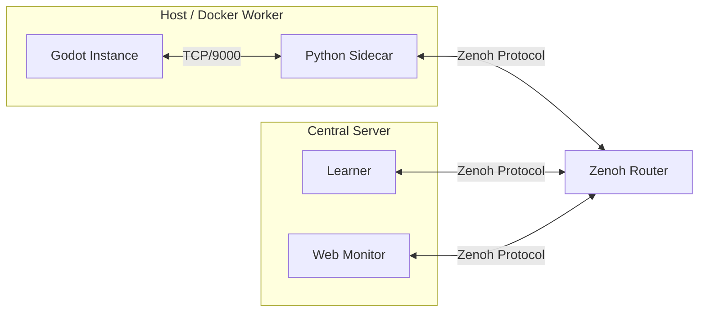

# AGI-Walker Distributed Training Guide

This guide details the **Zenoh-based Distributed Training Architecture** (Phase 6) for AGI-Walker. It enables massive parallel training by decoupling Godot simulation instances (Actors) from the central RL algorithm (Learner).

## 1. Architecture Overview



### Components
*   **Godot Instance**: Runs the physics simulation. Connects to local Sidecar via TCP.
*   **Sidecar (`distributed/sidecar.py`)**: Bridge node.
    *   Talks TCP to Godot.
    *   Talks Zenoh to the network.
    *   Handles **Data Compression** (Zlib > 1KB).
*   **Learner (`distributed/run_learner.py`)**: Central training node. Subscribes to all observations, computes actions.
*   **Web Monitor (`web_panel/server.py`)**: Visualizes active actors in real-time on the dashboard.

## 2. Quick Start (Local)

### Prerequisites
*   Python 3.8+
*   `pip install eclipse-zenoh numpy torch gymnasium`
*   Godot 4.5+

### Step-by-Step
1.  **Start Godot (Headless)**:
    ```bash
    godot --headless --path godot_project run_rl_server.tscn
    ```
    *listens on TCP 9000*

2.  **Start Sidecar**:
    ```bash
    python distributed/sidecar.py --id actor_1 --godot-host 127.0.0.1 --godot-port 9000
    ```

3.  **Start Learner**:
    ```bash
    python distributed/run_learner.py
    ```

4.  **Monitor**:
    Open `http://localhost:8000/static/distributed.html` (requires Web Panel running).

## 3. Docker Deployment (Cluster)

We provide `deployment/docker-compose.yml` for orchestrating the Python components.

```bash
cd deployment
docker-compose up --build
```

**Note**: Since Godot requires GPU/Display (or specific headless setup), the default compose file assumes Godot runs on the **Host Machine**. The Sidecar container connects to `host.docker.internal`.

### Configuration
*   **ZENOH_ROUTER**: Address of the Zenoh router (default `tcp/zenoh-router:7447`).
*   **GODOT_HOST**: Address of the Godot instance.

## 4. Optimization Features

*   **Zlib Compression**: Payloads > 1KB are automatically compressed by Sidecar. Learner/Monitor transparently decompress.
*   **Explicit Peering**: Sidecar listens on TCP `7447` to avoid multicast issues in some network environments.
*   **Heartbeats**: Monitor tracks `last_seen` to detect offline actors.

## 5. Troubleshooting

*   **"Connection Refused"**: Ensure Godot is fully started *before* running Sidecar.
*   **No Data on Dashboard**: Check `server.py` logs for `[Zenoh] Error`. Ensure Web Server and Sidecar are on the same Zenoh network (router).
