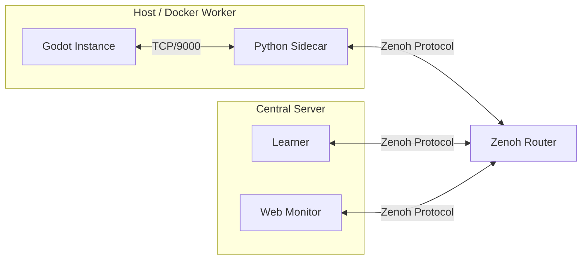

# AGI-Walker Distributed Training Guide

This guide details the **Zenoh-based Distributed Training Architecture** (Phase 6) for AGI-Walker. It enables massive parallel training by decoupling Godot simulation instances (Actors) from the central RL algorithm (Learner).

## 1. Architecture Overview



### Components
*   **Godot Instance**: Runs the physics simulation. Connects to local Sidecar via TCP.
*   **Sidecar (`distributed/sidecar.py`)**: Bridge node.
    *   Talks TCP to Godot.
    *   Talks Zenoh to the network.
    *   Handles **Data Compression** (Zlib > 1KB).
*   **Learner (`distributed/run_learner.py`)**: Central training node. Subscribes to all observations, computes actions.
*   **Web Monitor (`web_panel/server.py`)**: Visualizes active actors in real-time on the dashboard.

## 2. Quick Start (Local)

### Prerequisites
*   Python 3.8+
*   `pip install eclipse-zenoh numpy torch gymnasium`
*   Godot 4.5+

### Step-by-Step
1.  **Start Godot (Headless)**:
    ```bash
    godot --headless --path godot_project --scene run_rl_server.tscn
    ```
    *listens on TCP 9000*

2.  **Start Sidecar**:
    ```bash
    python distributed/sidecar.py --id actor_1 --godot-host 127.0.0.1 --godot-port 9000
    ```

3.  **Start Learner**:
    ```bash
    python distributed/run_learner.py
    ```

4.  **Monitor**:
    Open `http://localhost:8000/static/distributed.html` (requires Web Panel running).

## 3. Docker Deployment (Cluster)

We provide `deployment/docker-compose.yml` for orchestrating the Python components.

```bash
cd deployment
docker-compose up --build
```

Compose 姒涙顓绘导姘儙閸旑煉绱?

*   `zenoh-router`
*   `learner`
*   `sidecar-1`
*   `web-panel`

閸忔湹鑵戦敍?
*   `web-panel` 閺勵垶绮拋銈囨畱閺嶇绺?Web 闂堛垺婢橀梹婊冨剼閿涘奔绻氱拠?workflow 閹貉冨煑閸欐澘鎷伴崺铏诡攨妞ょ敻娼伴懗钘夊閸欘垱鐎鎭掆偓浣稿讲閸氼垰濮╅妴?*   `web-panel-distributed` 閺勵垰褰查柅?profile閿涘矂顤傛径鏍х暔鐟?`eclipse-zenoh`閿涘瞼鏁ゆ禍搴ㄦ付鐟曚礁婀€圭懓娅掗崘鍛纯閹恒儱鎯庨悽?Zenoh 閸掑棗绔峰蹇曟磧閹貉呮畱閸︾儤娅欓妴?
婵″倿娓堕崥顖氬З鐢箑鍨庣敮鍐ㄧ础閻╂垶甯舵笟婵婄閻?Web 闂堛垺婢橀崣妯圭秼閿?
```bash
cd deployment
docker compose --profile distributed up --build web-panel-distributed
```

Docker 閸︾儤娅欐稉瀣畱鐠佸潡妫堕崷鏉挎絻閿?
*   Web 闂堛垺婢樻稉濠氥€? `http://localhost:8080/static/index.html`
*   閸掑棗绔峰蹇曟磧閹貉囥€? `http://localhost:8080/static/distributed.html`
*   Workflow 閹貉冨煑閸? `http://localhost:8080/static/workflows.html`
*   閸欘垶鈧?`web-panel-distributed` 閸欐ü缍? `http://localhost:8081/static/index.html`

婵″倿娓堕幍褑顢戦張鈧亸?Docker 閸掑棗绔峰?smoke閿涘苯褰查惄瀛樺复閸︺劋绮ㄦ惔鎾寸壌閻╊喖缍嶆潻鎰攽閿?
```bash
python tests/run_distributed_smoke.py --build
```

鐠囥儴鍓奸張顑跨窗閸氼垳鏁?compose 閻?`distributed` 閸?`smoke` profiles閿涘苯鑻熸笟婵囶偧閹峰鎹ｉ敍?
*   `zenoh-router`
*   `learner`
*   `web-panel-distributed`
*   `mock-godot`
*   `sidecar-1`

閸忔湹鑵?`mock-godot` 閺勵垯绮庨悽銊ょ艾 smoke 妤犲矁鐦夐惃鍕氦闁?TCP 濞村鐦張宥呭閿涘瞼鏁ら弶銉︽禌娴狅絿婀＄€?Godot 鏉╂稓鈻奸敍宀€鈥樼拋?`sidecar-1 -> zenoh-router -> learner -> web-panel-distributed` 閺佸瓨娼柧鎹愮熅閸欘垯浜掗惇鐔割劀娴溠呮晸濞叉槒绌?actor閵嗗倿鐛欑拠渚€鈧俺绻冮崥搴礉閸欘垰婀敍?
*   `http://localhost:8081/static/distributed.html`
*   `http://localhost:8081/api/distributed/status`

閻鍩?actor 閻樿埖鈧礁鎷伴崺铏诡攨闁儲绁寸€涙顔岄妴?
**Note**:
*   Since Godot requires GPU/Display (or specific headless setup), the default compose file assumes Godot runs on the **Host Machine**. The Sidecar container connects to `host.docker.internal`.
*   Port `8000` on the host remains available for Zenoh Router HTTP/REST. The Web Panel is exposed on host port `8080`.
*   `GET /api/system/status` 閸?`GET /api/distributed/status` 閻滄澘婀导姘崇箲閸?`distributed_monitor` / `monitor` 閻樿埖鈧礁鐡у▓纰夌礉閻劋绨拠瀛樻瑜版挸澧犵€圭懓娅掗弰顖氭儊閸忓嘲顦?Zenoh 閻╂垶甯堕懗钘夊閵?*   `mock-godot` 閸欘亞鏁ゆ禍搴ゅ殰閸斻劌瀵?smoke閿涘奔绗夋惔鏃€娴涙禒锝囨埂鐎?Godot 闁劎璁茬捄顖氱窞閵?
### Configuration
*   **ZENOH_ROUTER**: Address of the Zenoh router (default `tcp/zenoh-router:7447`).
*   **GODOT_HOST**: Address of the Godot instance.
*   **AGI_WALKER_GODOT_HOST**: Compose/Smoke 娑?Sidecar 娴ｈ法鏁ら惃?Godot 娑撶粯婧€閸氬稄绱遍崚鍡楃瀵?smoke 姒涙顓绘导姘瘹閸?`mock-godot`閵?*   **AGI_WALKER_SIDECAR_ACTOR_ID**: 閸掑棗绔峰?smoke 娴ｈ法鏁ら惃?actor 閺嶅洩鐦戦敍宀勭帛鐠?`actor_docker_1`閵?*   **Web Panel pagination/archive policy**: `deployment/web_panel.env.example` is loaded into the `web-panel` service by default.
*   **AGI_WALKER_ZENOH_ENDPOINT**: Web 闂堛垺婢橀崚鍡楃瀵繒娲冮幒褑绻涢幒銉ユ勾閸р偓閵嗗倿绮拋?compose 闁板秶鐤嗘导姘瘹閸?`tcp/zenoh-router:7447`閵?*   **AGI_WALKER_DISTRIBUTED_ACTOR_TTL_SECONDS**: Web 闂堛垺婢樻穱婵堟殌 actor 閻ㄥ嫭娓舵径褏鈹栭梻鑼潡閺佸府绱濇妯款吇 `30`閵?
## 4. Optimization Features

*   **Zlib Compression**: Payloads > 1KB are automatically compressed by Sidecar. Learner/Monitor transparently decompress.
*   **Explicit Peering**: Sidecar listens on TCP `7447` to avoid multicast issues in some network environments.
*   **Heartbeats**: Monitor tracks `last_seen` to detect offline actors.
*   **TTL Cleanup**: Web monitor automatically prunes stale actors after the configured TTL so dashboards and `/api/distributed/status` do not accumulate dead entries forever.

## 5. Troubleshooting

*   **"Connection Refused"**: Ensure Godot is fully started *before* running Sidecar.
*   **No Data on Dashboard**: Check `server.py` logs for `[Zenoh] Error`. Ensure Web Server and Sidecar are on the same Zenoh network (router).
*   **Actor lingering too long**: Lower `AGI_WALKER_DISTRIBUTED_ACTOR_TTL_SECONDS` if you need more aggressive stale-actor cleanup in the Web monitor.
