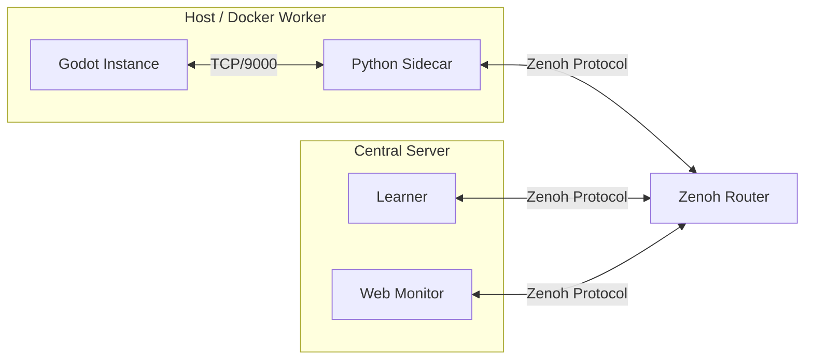

# AGI-Walker Distributed Training Guide

This guide details the **Zenoh-based Distributed Training Architecture** (Phase 6) for AGI-Walker. It enables massive parallel training by decoupling Godot simulation instances (Actors) from the central RL algorithm (Learner).

## 1. Architecture Overview



### Components
*   **Godot Instance**: Runs the physics simulation. Connects to local Sidecar via TCP.
*   **Sidecar (`distributed/sidecar.py`)**: Bridge node.
    *   Talks TCP to Godot.
    *   Talks Zenoh to the network.
    *   Handles **Data Compression** (Zlib > 1KB).
*   **Learner (`distributed/run_learner.py`)**: Central training node. Subscribes to all observations, computes actions.
*   **Web Monitor (`web_panel/server.py`)**: Visualizes active actors in real-time on the dashboard.

## 2. Quick Start (Local)

### Prerequisites
*   Python 3.8+
*   `pip install eclipse-zenoh numpy torch gymnasium`
*   Godot 4.5+

### Step-by-Step
1.  **Start Godot (Headless)**:
    ```bash
    godot --headless --path godot_project --scene run_rl_server.tscn
    ```
    *listens on TCP 9000*

2.  **Start Sidecar**:
    ```bash
    python distributed/sidecar.py --id actor_1 --godot-host 127.0.0.1 --godot-port 9000
    ```

3.  **Start Learner**:
    ```bash
    python distributed/run_learner.py
    ```

4.  **Monitor**:
    Open `http://localhost:8000/static/distributed.html` (requires Web Panel running).

## 3. Docker Deployment (Cluster)

We provide `deployment/docker-compose.yml` for orchestrating the Python components.

```bash
cd deployment
docker-compose up --build
```

Compose 默认会�动：

*   `zenoh-router`
*   `learner`
*   `sidecar-1`
*   `web-panel`

其中�
*   `web-panel` 是默认的核心 Web ��镜�，��workflow 控制�和基础页�能力�构建���动�*   `web-panel-distributed` 是��profile，�外安�`eclipse-zenoh`，用于需�在容器内直接��Zenoh 分布�监控的场景�
如需�动带分布�监控�赖�Web ���体�
```bash
cd deployment
docker compose --profile distributed up --build web-panel-distributed
```

Docker 场景下的访问地��
*   Web ��主页: `http://localhost:8080/static/index.html`
*   分布�监控页: `http://localhost:8080/static/distributed.html`
*   Workflow 控制� `http://localhost:8080/static/workflows.html`
*   ��`web-panel-distributed` �体: `http://localhost:8081/static/index.html`

如需执行最�Docker 分布�smoke，�直接在仓库根目录�行�
```bash
python tests/run_distributed_smoke.py --build
```

该脚本会�用 compose �`distributed` �`smoke` profiles，并�次拉起�
*   `zenoh-router`
*   `learner`
*   `web-panel-distributed`
*   `mock-godot`
*   `sidecar-1`

其中 `mock-godot` 是仅用于 smoke 验�的轻�TCP 测试�务，用�替代真�Godot 进程，确�`sidecar-1 -> zenoh-router -> learner -> web-panel-distributed` 整�链路�以真正产生活跃 actor。验�通过�，�在�
*   `http://localhost:8081/static/distributed.html`
*   `http://localhost:8081/api/distributed/status`

看到 actor 状�和基础�测字段�
**Note**:
*   Since Godot requires GPU/Display (or specific headless setup), the default compose file assumes Godot runs on the **Host Machine**. The Sidecar container connects to `host.docker.internal`.
*   Port `8000` on the host remains available for Zenoh Router HTTP/REST. The Web Panel is exposed on host port `8080`.
*   `GET /api/system/status` �`GET /api/distributed/status` 现在会返�`distributed_monitor` / `monitor` 状�字段，用于说明当�容器是�具备 Zenoh 监控能力�*   `mock-godot` �用于自动化 smoke，�应替代真�Godot 部署路径�
### Configuration
*   **ZENOH_ROUTER**: Address of the Zenoh router (default `tcp/zenoh-router:7447`).
*   **GODOT_HOST**: Address of the Godot instance.
*   **AGI_WALKER_GODOT_HOST**: Compose/Smoke �Sidecar 使用�Godot 主机�；分布�smoke 默认会指�`mock-godot`�*   **AGI_WALKER_SIDECAR_ACTOR_ID**: 分布�smoke 使用�actor 标识，默�`actor_docker_1`�*   **Web Panel pagination/archive policy**: `deployment/web_panel.env.example` is loaded into the `web-panel` service by default.
*   **AGI_WALKER_ZENOH_ENDPOINT**: Web ��分布�监控连接地�。默�compose �置会指�`tcp/zenoh-router:7447`�*   **AGI_WALKER_DISTRIBUTED_ACTOR_TTL_SECONDS**: Web ���留 actor 的最大空闲秒数，默认 `30`�
## 4. Optimization Features

*   **Zlib Compression**: Payloads > 1KB are automatically compressed by Sidecar. Learner/Monitor transparently decompress.
*   **Explicit Peering**: Sidecar listens on TCP `7447` to avoid multicast issues in some network environments.
*   **Heartbeats**: Monitor tracks `last_seen` to detect offline actors.
*   **TTL Cleanup**: Web monitor automatically prunes stale actors after the configured TTL so dashboards and `/api/distributed/status` do not accumulate dead entries forever.

## 5. Troubleshooting

*   **"Connection Refused"**: Ensure Godot is fully started *before* running Sidecar.
*   **No Data on Dashboard**: Check `server.py` logs for `[Zenoh] Error`. Ensure Web Server and Sidecar are on the same Zenoh network (router).
*   **Actor lingering too long**: Lower `AGI_WALKER_DISTRIBUTED_ACTOR_TTL_SECONDS` if you need more aggressive stale-actor cleanup in the Web monitor.
